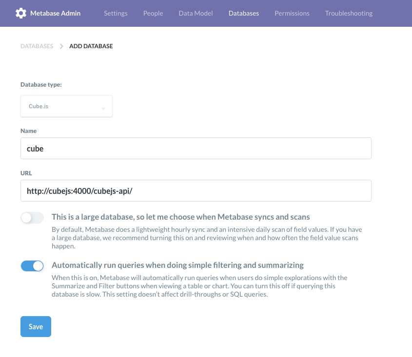
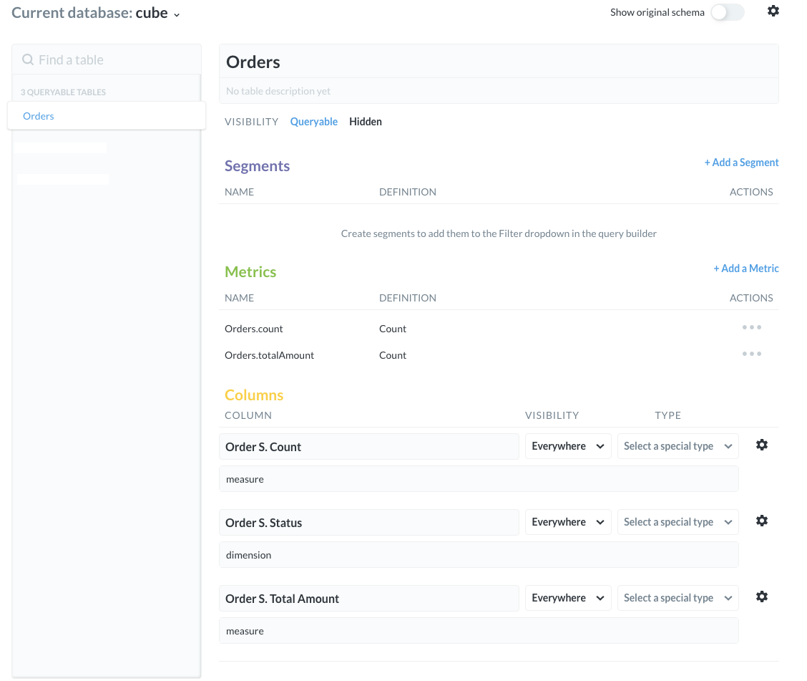
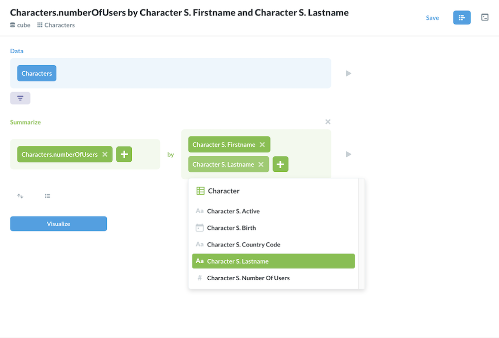

# metabase-cubejs-driver

With this driver you can use Cube.js as "backend" with Metabase as a "frontend". Create the schemas in Cube.js connect with Metabase and you are ready to go: make queries, filter the results and create beautiful charts and dashboards.

Explanation:

|    Cube.js   |Metabase|
|--------------|--------|
|   measure    | metric |
|   dimension  | field  |
|time dimension| field  |

**NOTE**: The driver is under development so expect some bugs and missing features. If you find one please create an issue.

# Features
## Working
- **Auto generate data model** from the schema fetched from the Cube.js API meta endpoint
- **Auto create metrics** from the measures. (These metrics are "invalid" when you try to edit them but still usable in queries.)
- native queries
- custom questions
- filters, orders, limit
## Not working
- Aggregations like sum, count and distinct. This should be done in Cube.js not in Metabase.

# Installation
## Requirements
- Metabase v0.35.0 or newer
## Get the driver
### Download
Download from the [releases](https://github.com/lili-data/metabase-cubejs-driver/releases).
### Build with Docker
1. Create the docker images: `make docker`
2. Build the driver: `make build`

### Build without Docker
[Use this guide.](https://github.com/tlrobinson/metabase-http-driver/blob/master/README.md#building-the-driver)

## Copy to your Metabase plugins
`cp cubejs.metabase-driver.jar /path/to/metabase/plugins/`  
Note: you have to restart Metabase to load new plugins

# Usage
1. Add and configure your Cube.js "DB" 
2. Inspect your Data Model 
3. Create a query
   - Native 
   - Custom question 
4. Explore the data 
# Development
## Roadmap
[v1.0.0](https://github.com/lili-data/metabase-cubejs-driver/milestone/1)

## Testing the driver
1. Create the docker images: `make docker`
2. Start a whole test environment: `make start`

# Contributing
- Any type of contributions are welcomed
- If you find a bug, missing feature or a simple typo just create an issue
- If you can fix/implement it create a pull request

# License
[GNU Affero General Public License v3.0 (AGPL)](https://github.com/lili-data/metabase-cubejs-driver/blob/master/LICENSE)